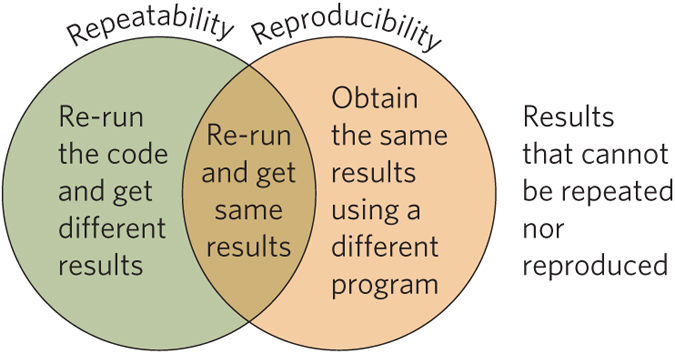

# Easterbrook, Open code for open science?, 2014

- "technical debt:"
  > why invest time writing beautifully engineered code from the outset, if
  > you're not sure that what you're trying to do is even possible?

- Manate technical dept:
  > such debts have to be managed carefully, to prevent them spiralling out of
  > control

- Central thesis:
  > I argue that open source policies are unlikely to usher in an era of much
  > greater sharing and reproducibility, because there are many barriers beyond
  > the basic requirement of being able to read the code (see Box 1). Instead,
  > such policies have an important role to play in improving the quality of
  > scientific software by nudging scientists to manage their technical debt
  > more carefully.

- Barriers to sharing:
  - (Lack of) Portability
  - (Lack of) Configurability
  - (Lack of) Entrenchment
  - Model-data blur
  - Provenance

- Repeatability vs. reproducibility
  - repeatability: Obtain different or same results with same code
  - reproducibilty: Obtain same results with same or different code
  - reapeatable and reproducible: Obtain same results with same code
  - all others

  

- "Myth of many eyes"
  - Majority of published code will not be looked at / used at all.
  - "On a different note, in the polarized context of climate research, making
    code available to public scrutiny holds the potential to improve trust."
  - "denial-of-service attacks"
  - "Making code available can therefore only work on the understanding that it
    does not involve the obligation to support others in repeating the
    computations."

> Building on such a culture of openness, an environment may eventually develop
> where small data sets and new software tools can be more readily discovered,
> and where reproducibility is achieved more easily.

[Easterbrook2014]: http://www.nature.com/ngeo/journal/v7/n11/full/ngeo2283.html
