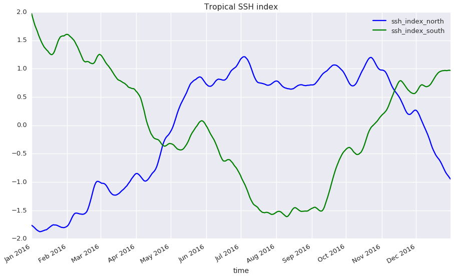

# Towards Reproducible Science

## Two parts

**Part one:** *As a dummy project, we'll look at the seasonal cycle of
sea-level.  We expect that there is a phase shift of 1/2 year between the
northern and the southern hemisphere.*

**Part two:** *We'll see which building blocks for a reproducible scientific
workflow are available.*

## Part one:  Two simple time series

**Challenge:** Those of you who have an idea what this plot shows, please do
now take a note (in pseudo-code or code) on how you would produce it.  Please
be specific about when and how you select regions, calculate averages, and
modify the data otherwise.



**Figure 01.** *Standardized mean SSH for the northern (blue) and southern
(green) tropics.*

## Reproducibility

Let's say a paper presents reproducible science if for any reader it is **in
principle** possible to **completely understand** and **repeat all steps** the
authors took from their initial idea to the final conclusions.

This often means, that the following must be specified:

1. Which input data were used?

2. How was the data treated to produce all figures and numbers given in the
   paper?

3. (Bonus) For any non-obvious choice of treatment of the data:  Why did the
   authors do what they did?

## How to adequately describe our figure?

### The sloppy way (see above)

> *Figure 01.*  Standardized mean SSH for the northern (blue) and southern
> (green) tropics.

This clearly is problematic:

- Which data set and which variables from the data set were used?
- Which data points / times / regions were included / excluded?
- What's standardized?
- Was there any additional processing?

### A better way

> *Figure 1.* The blue / green line show standardized (`mean=0`, `std-dev=1`)
> mean SSH for the northern / southern tropics.  The lines represent spatial
> averages of daily absolute dynamic topography from SLTAC between the Equator
> and 23.43699°N / 23.43699°S and the Equator.

We now know that

- daily SLTAC ADT fields were used,
- the data were spatially averaged,
- the standardized data has `mean=0` and `std-dev=1`,
- northern / southern tropics are defined as the regions between 0 and
  23.43699°N / 23.43699°S and 0.

But still:

- Could we be sure to find **exactly** the same data?
- How did the authors weight each grid point?
- How exactly and at what point did the authors standardize the data?
- Did they include missing data?  (And does it make a difference?)

### Towards full reproducibility

> *Figure 1.* The blue / green line show standardized (`mean=0`, `std-dev=1`)
> mean SSH for the northern / southern tropics.  The lines represent spatial
> averages of daily absolute dynamic topography from SLTAC between the Equator
> and 23.43699°N / 23.43699°S and the Equator.  A script containing the full
> code to produce the figure and a data file containing the time series data
> that are plotted here are included in the supplementary materials.

### The (essential parts of the) script

This is where you should have a look at your notes and compare.  (Note that
there's not necessarily a correct or best way to do this analysis.  But you
might notice  that there are many ways that are fully compatible with a short
description of the figure.)

```python
from pathlib import Path
import xarray as xr

base_data_path = Path("/data/c2/TMdata/git_geomar_de_data/")
data_files = [str(fn) for fn in base_data_path.glob(
    "SLTAC_GLO_PHY_L4_REP/v1.x.x/data/2016/dt*nc")]

ssh = xr.open_mfdataset(data_files).adt

def standardize_time_series(data):
    """Return data with mean zero and std.-dev. one."""
    return (data - data.mean(dim="time")) / data.std(dim="time")

def spatial_average_between_latitudes(
    data, lat_min=-90.0, lat_max=90.0, new_name=None):
    """Return spatially averaged `data`.

    The data are not weighted and missing data are excluded.
    """
    data = data.sel(latitude=slice(lat_min, lat_max))
    data = data.mean(dim=["latitude", "longitude"])
    data = data.rename(new_name)
    return data

# first average (both, lat and lon, simultaneously), then standardize
ssh_index_north = standardize_time_series(spatial_average_between_latitudes(
    ssh, lat_min=0.0, lat_max=23.43699, new_name="SSH index North"))
ssh_index_south = standardize_time_series(spatial_average_between_latitudes(
    ssh, lat_min=-23.43699, lat_max=0.0, new_name="SSH index South"))

ssh_index_north.plot();
ssh_index_south.plot();
```

#### Saving data for reference

```bash
output_dataset = xr.Dataset({'ssh_index_north': ssh_index_north,
                             'ssh_index_south': ssh_index_south})
output_dataset.to_netcdf("fig_01_tropical_ssh_index.nc")
```

#### Data provenance

We use a data set from a [version controlled data repository](https://git.geomar.de/data/SLTAC_GLO_PHY_L4_REP/):

```python
base_data_path = Path("/data/c2/TMdata/git_geomar_de_data/")
data_files = [str(fn) for fn in base_data_path.glob(
    "SLTAC_GLO_PHY_L4_REP/v1.x.x/data/2016/dt*nc")]
```

Moreover, the following tells us that we're using `v1.1.0` of the
`SLTAC_GLO_PHY_L4_REP` data set:
```bash
cd /data/c2/TMdata/git_geomar_de_data/SLTAC_GLO_PHY_L4_REP/v1.x.x/
pwd -P
/home/wrath/TM/software/miniconda3_latest/envs/git/bin/git describe
```
```
/data/c2/TMdata/git_geomar_de_data/SLTAC_GLO_PHY_L4_REP/v1.x.x
v1.1.0
```

This provides a complete history of our mirror of the data set:
> <https://git.geomar.de/data/SLTAC_GLO_PHY_L4_REP/commits/v1.1.0>

#### Tools that were used

```bash
conda list
```
```
# packages in environment at /home/wrath/TM/software/miniconda3_20170727/envs/py3_std:
#
alabaster                 0.7.10                   py35_1    conda-forge
anaconda-client           1.6.5                      py_0    conda-forge
aospy                     0.1.2                    py35_0    conda-forge
[...]
xarray                    0.9.6                    py35_0    conda-forge
xz                        5.2.3                         0    conda-forge
yaml                      0.1.6                         0    conda-forge
zeromq                    4.2.1                         1    conda-forge
zict                      0.1.3                      py_0    conda-forge
zlib                      1.2.8                         3    conda-forge
```

## Part two: Infrastructure at Geomar

---

### Version controlled source

#### Why?

Don't version-control backwards.  There always will be a next version.  So plan
accordingly right at the beginning.

### Self-documenting analysis

nb.geomar.de and Jupyter Notebooks provide a way of writing analyses where
documentation is (almost) for free.

### Version controlled (upstream) data

Git LFS at git.geomar.de provide a way to version control own data and virtually
all external / upstream data.

## Todo

Best practices:  How much to document?  And where?  (In a separate repository, supplementary materials, in the paper?)

Culture:  Be confident to publish your code add data.

Culture (cont.):  How to establish ethical / un-ethical use of code and data
published by others?

## References

[Hinsen2015]: https://khinsen.wordpress.com/2015/01/07/why-bitwise-reproducibility-matters/

[Hinsen2017]: http://blog.khinsen.net/posts/2017/05/04/which-mistakes-do-we-actually-make-in-scientific-code/

[MIAME]: http://fged.org/projects/miame/

[Wilson2012]: https://arxiv.org/abs/1210.0530

[Irving_carpentry]: http://damienirving.github.io/capstone-oceanography/03-data-provenance.html

[Nature_CodeShare]: https://www.nature.com/news/code-share-1.16232

[Sandve2013]: http://journals.plos.org/ploscompbiol/article?id=10.1371/journal.pcbi.1003285

[Stodden2010]: https://papers.ssrn.com/sol3/papers.cfm?abstract_id=1550193

[MPI_good_scientific_practice]: http://www.mpimet.mpg.de/en/science/publications/good-scientific-practice.html

[Barnes2010]: https://www.nature.com/news/2010/101013/full/467753a.html

[Irving2015]: http://journals.ametsoc.org/doi/full/10.1175/BAMS-D-15-00010.1

[Chavan2015]: https://arxiv.org/abs/1506.04815

[XSEDE2014_repro]: https://www.xsede.org/documents/659353/d90df1cb-62b5-47c7-9936-2de11113a40f
