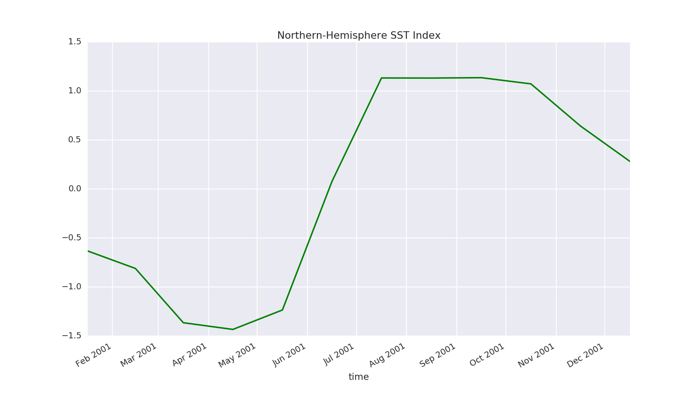

class: middle, center

# ~~Reproducible~~ Repeatable Work Flows

Willi Rath (wrath@geomar.de)

.medium[**Thanks:** *Martin Claus, Christina Roth, Carsten Schirnick, Claas
Faber, Kai Grunau, Klaus Getzlaff, Torge Martin, ...*]

---

class: middle, left

## Part One — A (Repeatable?) Analysis

*As an example project, we'll look at the seasonal cycle of sea-surface
temperature (SST) on the northern hemisphere.*

## Part Two — Repeatable Workflows at Geomar

*We'll go through building blocks for a repeatable work flow are available at
Geomar.*

---

class: middle, left

## Challenge

Those of you who have an idea what this plot shows, please do now **take a
note** (in pseudo-code or code) on how you would produce the following figure.

Please be specific about **when** and **how** you select regions, calculate
averages, and modify the data otherwise.

---

## Part one:  Two simple time series



**Figure 01.** *Standardized mean SST for the northern hemisphere.*

---

class: middle

## Repeatability

Let's say an analysis is **repeatable**, if for any sufficiently skilled reader
it is **in principle** possible to **completely understand** and **repeat all
steps** the authors took from their initial idea to the final conclusions.

---

class: middle

## "completely understand and reapeat all steps"

1. Which **input data** were used?

2. **How** was the data treated to produce all **figures** and **numbers**
   given in the paper?

3. **Why** did the authors do what they did? ← *a bonus?*

---

class: middle, center

## Back to the Figure

---

class: left, middle


**Figure 01.** *Standardized mean SST for the northern hemisphere.*

---

## The Sloppy Way

**Figure 01.** *Standardized mean SST for the northern hemisphere.*

--

--------

(Quite obvious) **problems**:

- Which **data set** and which **variables** from the data set were used?

- Which **locations / times / regions** were included / excluded?

- What's the definition of **standardized**?

---

## Giving More Details

**Figure 01.** *Standardized (`mean=0`, `std-dev=1`) northern-hemisphere mean
of monthly-mean HadISST sea-surface temperature (SST).*

--

--------

We now know that

- monthly **HadISST** **SST** fields were used,

- the data were **spatially averaged**,

- the **standardized** data have `mean=0` and `std-dev=1`,

- the data have been averaged over the **northen hemisphere**.

---

## Giving More Details

**Figure 01.** * **Standardized** (`mean=0`, `std-dev=1`)
**northern-hemisphere** mean of monthly-mean **HadISST** sea-surface
temperature (**SST**). *

--------

But **still**:

- Could we be sure to find **exactly** the same data?

- How did the authors **weight** each grid point?

- How exactly and **at what point** did the authors **standardize** the data?

- Did they include **missing data**?  (And does it make a difference?)

- …

---

class: middle

## Towards Full Repeatability

**Figure 01.** * **Standardized** (`mean=0`, `std-dev=1`) **northern-hemisphere**
mean of monthly-mean **HadISST** sea-surface temperature (**SST**). There are
a Jupyter notebook and a data file with all the details in the **supllementary
materials**. *

---

class: middle

## The (essential parts of the) Supplementary Script

This is where you should have a look at your notes and compare.

---

### Calculating and Plotting the SST Index

```python
from pathlib import Path
import xarray as xr

base_data_path = Path("/data/c2/TMdata/git_geomar_de_data/")
data_file = base_data_path / "HadISST/v1.x.x/data/HadISST_sst.nc"

sst = xr.open_dataset(data_file).sst
sst = sst.sel(time=slice("2001-01-01", "2002-01-01"))


def standardize_time_series(data):
    """Return data with mean zero and std.-dev. one."""
    return (data - data.mean(dim="time")) / data.std(dim="time")


def spatial_average_between_latitudes(data, lat_min=-90.0, lat_max=90.0, new_name=None):
    """Return spatially averaged `data`.

    The data are not weighted.  Missing data are excluded.
    """
    data = data.sel(latitude=slice(lat_min, lat_max))
    data = data.mean(dim="latitude").mean(dim="longitude")
    data = data.rename(new_name)
    return data

sst_index_north = standardize_time_series(spatial_average_between_latitudes(
    sst, lat_max=0.0, lat_min=90.0))

sst_index_north.plot()
```

---

class: middle

### Saving Data for Reference

```python
output_dataset = xr.Dataset({'sst_index_north': sst_index_north})
output_dataset.to_netcdf("fig_01_sst_index.nc")
```

---

## Data Provenance

We use a data set from a [fully version-controlled data
repository](https://git.geomar.de/data/HadISST/):

```python
base_data_path = Path("/data/c2/TMdata/git_geomar_de_data/")
data_file = base_data_path / "HadISST/v1.x.x/data/HadISST_sst.nc"
```

--

--------

Moreover, the following tells us that we're using `v1.3.0` of the
`HadISST` data set:
```bash
git --work-tree="/data/c2/TMdata/git_geomar_de_data/HadISST/v1.x.x/" describe
```
```
/data/c2/TMdata/git_geomar_de_data/HadISST/v1.x.x
v1.3.0
```

--

--------

To learn more about the data set, check:

- <https://git.geomar.de/data/HadISST/commits/v1.3.0> for a complete history of
  the our mirror of the data set,

- <https://git.geomar.de/data/HadISST> for a general overview, a README of the
  current version, etc.

---

## Tools and Libraries

The following lists the complete Python environment that was used in the
analysis:

```bash
conda list
```
```
# packages in environment at /home/wrath/TM/software/miniconda3_20170727/envs/py3_std:
#
alabaster                 0.7.10                   py35_1    conda-forge
anaconda-client           1.6.5                      py_0    conda-forge
[...]
xarray                    0.9.6                    py35_0    conda-forge
xarray-0.9.6-51           g25d1855                  <pip>
xz                        5.2.3                         0    conda-forge
yaml                      0.1.6                         0    conda-forge
zeromq                    4.2.1                         1    conda-forge
zict                      0.1.3                      py_0    conda-forge
zlib                      1.2.8                         3    conda-forge
```

---

## Evolution of the Analysis

To tell how this analysis developed in time, check:

<https://git.geomar.de/willi-rath/towards_reproducible_science/commits/master>

--

--------

This is a **time line** of every step towards the current version of this talk,
and the dummy analysis presented here.  Suppose, we developed the analysis as
part of a multi-author paper.  Then, it would be possible to return to any
specific version of the scripts at any later point, compare scripts between
revisions sent to the journal, or roll back any changes that are perhaps later
found to be wrong.

---

class: middle

## Summary of Part One

Possible aspects of repeatability are

1. a small and easy-to-use data set containing **all the numbers** necessary to
   re-plot and compare the data presented in the analysis,

2. fully **documented steps** from the original data to the final presentation
   (plots, tables, etc.),

3. an overview of all the **tools** and **libraries** used in the analysis and
   of their exact versions,

4. a **time-line** of the development of the analysis,

5. and a pointer to the full **raw data** used in the analysis (**data
   provenance**).

---

class: middle, center

## Part Two — Repeatable Workflows at Geomar

---

## Part Two — Repeatable Workflows at Geomar


1. **all the numbers**

2. **documented steps**

3. **tools** and **libraries**

4. **time-line**

5. **raw data** and **data provenance**

Currently, many journals are requiring authors to provide some form of *1* and /
or *2*.  But expect so see more and more requests for *3* to *5*.

Here, we'll look through the requirements 1. to 5. and examine to what extent,
there are (easy?) ways to fulfill them.

---

class: middle

## "All The Numbers" (1.)

1. **all the numbers**

2. **documented steps**

3. **tools** and **libraries**

4. **time-line**

5. **raw data** and **data provenance**

---

## "All The Numbers" (1.) ← <https://data.geomar.de>

--

- meant to serve as a **stable** point of **first contact** for anybody looking
  for a dataset from Geomar

- today: **collection of links** to data for papers etc.

.medium[If a journal requires you to provide a reference to the data, this
might be the information to give.  (Talk to <datamanagement@geomar.de> before
doing so.)]

--

--------

Some alternatives:

- At TM, we have <data-tm@geomar.de> which will be forwarded to whoever will be
  in charge of data management.

- https://zenodo.org provides storage and a DOI for data.

--

--------

*Note that the **hard part** is not providing a point of contact for those
requesting the data.  The hard part is **being able to provide the data** at
any given time.*

---

class: middle

## "Documented steps" (2.)

1. **all the numbers** ← <https://data.geomar.de>

2. **documented steps**

3. **tools** and **libraries**

4. **time-line**

5. **raw data** and **data provenance**

---

## "Documented steps" (2.) ← <https://nb.geomar.de>

- Jupyter **frontend** to virtually all the **large machines** (in-house and
  external)

- **beautifully rendered** analyses

- automatic **documentation** is (almost) **for free**

- bonus:  The Geomar **Git** server renders Jupyter notebooks!

--

--------

It is definitely possible (and currently done) to do *all* analyses in your PhD
project with Jupyter and on <https://nb.geomar.de>.

---

class: middle

## "Tools and Libraries" (3.)

1. **all the numbers** ← <https://data.geomar.de>

2. **documented steps** ← <https://nb.geomar.de>

3. **tools** and **libraries**

4. **time-line**

5. **raw data** and **data provenance**

---

## "Tools and Libraries" (3.) ← [Conda environments](https://git.geomar.de/python/conda_environments/)

- use Anaconda (**Python** and **R**) and Conda-Forge (far beyond)

- explicitly **manage** and **document** full working **environments**

- across **different machines**

- standard environments

  - <https://git.geomar.de/python/conda_environments/>

  - on all the major analysis machines ← <https://nb.geomar.de>

---

class: middle

## "Time Line" (4.)

1. **all the numbers** ← <https://data.geomar.de>

2. **documented steps** ← <https://nb.geomar.de>

3. **tools** and **libraries** ← <https://git.geomar.de/python/conda_environments/>

4. **time-line**

5. **raw data** and **data provenance**


---

## "Time Line" (4.) ← <http://git.geomar.de>

- **full-blown** version control environment

- for **Geomar members** and for **external collaborators**.

- hosted at Geomar

- continuous integration

- unlimited projects

- project management

- …

---

class: middle

## "Data Provenance" (5.)

1. **all the numbers** ← <https://data.geomar.de>

2. **documented steps** ← <https://nb.geomar.de>

3. **tools** and **libraries** ← <https://git.geomar.de/python/conda_environments/>

4. **time-line** ← <https://git.geomar.de>

5. **raw data** and **data provenance**

---

## "Data" (5.) ← <https://git.geomar.de/data/>

- version control own and external data with Git LFS

- available at <https://git.geomar.de>

- tracking Terabytes (or more) of model output is beyond reach for now

--

--------

<https://git.geomar.de/data/docs/>

- Growing collection of external data sets.

- [Also available on the thredds
  server](https://data.geomar.de/thredds/catalog/tmdata/git_geomar_de_data/catalog.html)

--

--------

Transparently store large model data sets:

- clear hierarchical directory structure

- "single source of truth"

---

class: middle

## Summary

1. **all the numbers** ← <https://data.geomar.de>

2. **documented steps** ← <https://nb.geomar.de>

3. **tools** and **libraries** ← <https://git.geomar.de/python/conda_environments/>

4. **time-line** ← <https://git.geomar.de>

5. **raw data** and **data provenance** ← <https://git.geomar.de/data/>

---

## The (in my opinion) Best Part?

- only weak links between components

- "plumbing" relies on standard sysadmin skills

    - ⇒ limited effects of failure / unavailability

    - ⇒ profit only from what you need

    - ⇒ remain fully independent from all other components

--

--------

If you **leave** Geomar, it is very easy to **take**

- all your **projects** from <https://git.geomar.de>,
- all your **data**,
- all your **notebooks**,
- setup scripts for conda **environments identical** to those available at
  Geomar,
- ...

---

class: middle

## But Do You Need This?

**Public debate** focused on:

- **fraud** prevention

- **facilitating** communication **within the community**

So we're fine.

... but are we?

---

class: top

## But Do You Need This?

--

**Your boss:** *"Can you update the plot from our 2012 paper with the latest data?"*

--

----

**You:** *Can you check this sea-level trend against satellite data?"*

**Student:** (all set up for two weeks of googling satellite data sets) *"Sure..."*

--

**You:** *"[Here's a
script](https://git.geomar.de/edu/python-intro/blob/master/Session_04/Session_04_02_xarray.ipynb)
where I did a similar thing with the [old AVISO
data](https://git.geomar.de/data/AVISO). Maybe it's good to start there.
When you're familiar with this one, adapt it to the new [SLTAC
product](https://git.geomar.de/data/SLTAC_GLO_PHY_L4_REP)."*

---

class: middle, center

# ~~But Do~~ You Need This !

---

## What Do You Do Now?

- Have a **mental framework** to think about repeatability. ← This talk ...

--

- Script all your analyses.  Avoid (undocumented) interactive work whenever
  possible.

- Keep track of your data.

- Have a standard of numbering your versions.  (Always forward.  There
  should be no files called `.txt.old`!)

----

- Learn to use Git or any other version-control system.

- Skim [Sandve (2013)][Sandve2013] for the **"10 Repeatability Commandments"**.

- Read the [reference sheet of Wilson (2012)][Wilson2012] to **be prepared for
  coding**.

---

class: middle

## What Do We Do Now?

**Culture:**

- Be(come more) **confident to publish** your code and data.

- Establish **ethics** with respect to use of code and data published by
  others.

Develop **Best practices:**

- **How much** to document?

- **Where** to document?

---

class: middle, center

# Thanks!

[Barnes2010]: https://www.nature.com/news/2010/101013/full/467753a.html

[Bhadrwaj2014]: https://arxiv.org/abs/1409.0798

[Chavan2015]: https://arxiv.org/abs/1506.04815

[Easterbrook2014]: http://www.nature.com/ngeo/journal/v7/n11/full/ngeo2283.html

[Hinsen2015]: https://khinsen.wordpress.com/2015/01/07/why-bitwise-reproducibility-matters/

[Hinsen2017]: http://blog.khinsen.net/posts/2017/05/04/which-mistakes-do-we-actually-make-in-scientific-code/

[Irving_carpentry]: http://damienirving.github.io/capstone-oceanography/03-data-provenance.html

[Irving2015]: http://journals.ametsoc.org/doi/full/10.1175/BAMS-D-15-00010.1

[Merali2010]: https://www.nature.com/doifinder/10.1038/467775a

[MIAME]: http://fged.org/projects/miame/

[MPI_good_scientific_practice]: http://www.mpimet.mpg.de/en/science/publications/good-scientific-practice.html

[Nature_CodeShare]: https://www.nature.com/news/code-share-1.16232

[Sandve2013]: http://journals.plos.org/ploscompbiol/article?id=10.1371/journal.pcbi.1003285

[Stodden2010]: https://papers.ssrn.com/sol3/papers.cfm?abstract_id=1550193

[Wilson2012]: https://arxiv.org/abs/1210.0530

[XSEDE2014_repro]: https://www.xsede.org/documents/659353/d90df1cb-62b5-47c7-9936-2de11113a40f
