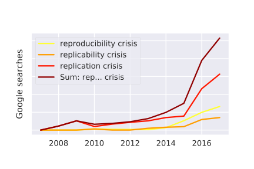
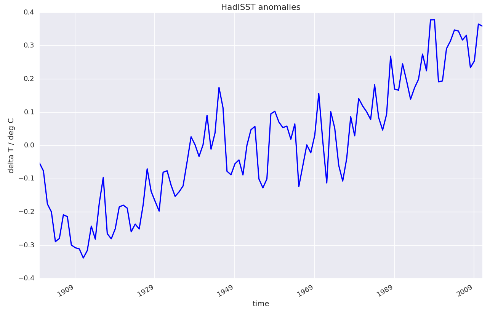

class: middle, left
count: false

# Towards <br>_Efficient & Reproducible_<br> Science

Willi Rath | <wrath@geomar.de>

<p>&nbsp;</p>

.smaller[Thanks: _ Martin&nbsp;Claus, Claus&nbsp;Böning, Torge&nbsp;Martin,
Markus&nbsp;Scheinert, Klaus&nbsp;Getzlaff, Franziska&nbsp;Schwarzkopf,
Christina&nbsp;Roth, Rafael&nbsp;Abel, Arne&nbsp;Biastoch,
Kristin&nbsp;Burmeister, Julia&nbsp;Getzlaff, Carsten&nbsp;Schirnick,
Claas&nbsp;Faber, Kai&nbsp;Grunau, Stefan&nbsp;Jöhnke, Lutz&nbsp;Griesbach,
Thomas&nbsp;Grunert, Knut&nbsp;Günther, Friedrich&nbsp;Althausen, GEOMAR
Data-Management&nbsp;Team, GEOMAR IT&nbsp;Department, … _]

<p>&nbsp;</p>

.smaller[.right[
slides —
<https://willirath.gitlab.io/towards_reproducible_science/><br>
Git repo —
<https://gitlab.com/willirath/towards_reproducible_science/>]]

---

class: middle, center



.smaller[.right[ [This notebook][fig_00_notebook_on_nbviewer] has details.]]

???

_**External**_ motivation: growing public debate about the
“reproducibility crisis”

---

class: middle, center


.smaller[.right[From [Baker (2016)][Baker2016]]]

???

Study surveyed researchers from all branches of the sciences see a crisis.

---

class: middle

## ... not my department?

_Public debate_ mostly focused on _fraud prevention_ in the medical
sciences.

.right[— I’ll argue that it’s _**you**_ who’d benefit from reproducibility.]

???

_**your**_ benefits > requirements by journals / funding agencies

---

class: middle, center

.center[]

---

class: left, middle

> _**You:**_
> “Can you check this sea-level trend against satellite data?”
>
> _**Student:**_
> “... sure ...”
>
> _(student about to leave for two weeks of googling for data)_
>
> _**You:**_
> “Hey wait, [here’s a script
> ](https://git.geomar.de/edu/python-intro/blob/master/Session_04/Session_04_02_xarray.ipynb)
> where I did a similar thing with the [old AVISO
> data](https://git.geomar.de/data/AVISO). Maybe it’s good to start there? When
> you’re familiar with this one, adapt it to the new [SLTAC
> product](https://git.geomar.de/data/SLTAC_GLO_PHY_L4_REP).”

???

The last statement is actually a summary of almost all of this talk:

- Version controlled source code ← “here’s a script”
- Version controlled data ← data set links
- very concise ways of (un-ambiguously!) referencing code and data

---

class: middle, left


.smaller[.right[From [Easterbrook (2014)][Easterbrook2014]]]

???

Avoid _philosophic_ or _semantic_ subtleties by reducing objective to simplest
of the possible tasks:  Being able to _**repeat**_ whatever was done.

---

class: middle, left

## Repeatability _~~Reproducibility~~_

> Let’s say an analysis is _repeatable_, if for any _sufficiently skilled_
> reader it is _in principle_ possible to _completely understand_ and
> _repeat all steps_ the authors took from their initial idea to the final
> conclusions.

???

Or worded differently:  Make sure there’s no need to know any _**secrets**_ to
repeat what was done.

---

class: center, middle

## Example — A Simple Time Series?

---

class: center, middle
count: false



_**Figure 01.**_ Annual-mean HadISST anomalies.

???

This is a variant of the “hockey stick” (often longer time series of air or
surface temperature).

---

class: top, left

### The Sloppy Way

.center[]

> .center[_**Figure 01.**_ Annual-mean HadISST anomalies.]

???

**Problems**:

- Which _locations_ / _times_ / _regions_ were included / excluded?

- What is the _reference period_ for the anomalies?

- …

---

class: top, left

### Giving More Details

.center[]

> _**Figure 01.**_ Global-mean and annual-mean HadISST anomalies relative to
> the full period from 1900 to 2010.

???

We now know that:

- the time series represents _global_ and _annual means_,

- the anomalies were calculated _relative to_ the _complete time series_.

But still:

- Could we be sure to find _exactly_ the same data?

- Are those _weighted or arithmetic_ spatial averages?

- How exactly and _in which order_ did the authors calculate the temporal
  means / spatial means / temporal anomalies?

- …

---

class: top, left

### Towards Full Repeatability

.center[]

> _**Figure 01.**_ Global-mean and annual-mean HadISST anomalies relative to
> the full period from 1900 to 2010.  There are a Jupyter notebook and a data
> file with all the details in the _supplementary materials_.

---

class: top, left
count: false

### Towards Full Repeatability

.center[]

> _**Figure 01.**_ Global-mean and annual-mean HadISST anomalies relative to
> the full period from 1900 to 2010.  There are a
> [Jupyter notebook][fig_01_notebook_on_nbviewer] and a
> [data file][fig_01_data_file_on_pages] with all the details in the
> _supplementary materials_.

???

- There is a [Jupyter notebook][fig_01_notebook_on_nbviewer] that contains the full
  analysis from the initial HadISST fields to the final plot.

- There is a [data file][fig_01_data_file_on_pages] that contains all numbers used
  to produce the figure.

---

### The Jupyter Notebook

```python
import numpy as np
import xarray as xr

data_file = "/data/c2/TMdata/git_geomar_de_data/HadISST/v1.x.x/data/HadISST_sst.nc"

sst = xr.open_dataset(data_file).sst
sst = sst.sel(time=slice("1900-01-01", "2011-01-01"))
sst = sst.where(sst != -1000.0)

def weighted_global_mean(data):
    cosine_latitude = np.cos(np.pi / 180.0 * data.coords["latitude"])
    data = ((cosine_latitude * data).sum(dim=["latitude", "longitude"])
            / (cosine_latitude + 0 * data).sum(dim=["latitude", "longitude"]))
    return data

def annual_mean(data):
    data = data.resample(time="12M").mean(dim="time")
    return data

def temporal_anomaly(data):
    data = data - data.mean("time")
    return data

sst_anomalies = temporal_anomaly( weighted_global_mean( annual_mean( sst )))

sst_anomalies.plot()
```

.right[.smaller[This code shows the essential parts of the analysis. [The full notebook is here.][fig_01_notebook_on_nbviewer]]]

???

# First: discuss this code snippet

# Then: switch to the Notebook

---

class: middle
count: false

### Saving the Plotted Data for Reference

```python
[...]
output_data_set = xr.Dataset({"global_and_annual_mean_SST_anomalies": sst_anomalies})
output_data_set.to_netcdf(file_name)
[...]
```

.smaller[.right[[Click here for the full notebook][fig_01_notebook_on_nbviewer] and [here for the data file.][fig_01_data_file_on_pages]]]

---

class: left, middle

### Raw Data

We use the [HadISST data set][HadISST_on_git] from a
[repository][git_geomar_de_data_docs] of fully _version-controlled_ data sets:

```python
[...]
data_file = Path("/data/c2/TMdata/git_geomar_de_data/HadISST/v1.x.x/data/HadISST_sst.nc")
[...]
```

<p>&nbsp;</p>

From within the notebook, we find out that at the time of the analysis,
`HadISST` `v1.3.0` was the latest of the `v1.x.x` versions:
```bash
git --work-tree="/data/c2/TMdata/git_geomar_de_data/HadISST/v1.x.x/" describe
```
```bash
v1.3.0
```

---

class: left, middle
count: false

### Raw Data

> _“We used v1.3.0 of the HadISST data set from our
> [internal mirror][git_geomar_de_data].”_

This _completely defines_ the raw data:

- General information: <https://git.geomar.de/data/HadISST>

- Full history up to version v1.3.0: <https://git.geomar.de/data/HadISST/commits/v1.3.0>

- Other data sets, examples, download requests: <https://git.geomar.de/data/docs/>

---

class: middle

### Tools and Libraries

Within the [Jupyter notebook][fig_01_notebook_on_nbviewer], we list the
_complete_ Python _environment_ that was activated during the analysis:

```bash
conda list
```
```bash
# packages in environment at /home/wrath/TM/software/miniconda3_20170727/envs/py3_std:
#
alabaster                 0.7.10                   py35_1    conda-forge
anaconda-client           1.6.5                      py_0    conda-forge
[...]
xarray-0.9.6-51           g25d1855                  <pip>
xz                        5.2.3                         0    conda-forge
yaml                      0.1.6                         0    conda-forge
zeromq                    4.2.1                         1    conda-forge
zict                      0.1.3                      py_0    conda-forge
zlib                      1.2.8                         3    conda-forge
```

.right[.smaller[... reproduce the env by feeding this list back to
`conda`.]]

---

class: left, middle

### Evolution of the Analysis

The development of the analysis (and of this talk) was tracked on
[Gitlab.com](https://gitlab.com).

To see how it developed in time, check:<br>
<https://gitlab.com/willirath/towards_reproducible_science/commits/master>

<p>&nbsp;</p>

Suppose, this was a multi-author paper.  Then, it would be easy

- to _return_ to any _earlier version_ of the scripts at any later point, or

- to _compare_ scripts between _revisions_ sent to the journal.

---

class: middle, left

## Interlude

Let’s compare different ways to calculate the SST anomalies:

.center[]

.right[.smaller[*... need your notes*]]

---

count: false

## Interlude - Two Lines

[This notebook][fig_02_notebook_on_nbviewer] details a subtlety with the _order_ of
averaging:

.center[]

???

Difference arise from subtleties in treating missing data making sum, mean,
etc. lose strict linearity.

---

count: false

## Interlude - Twelve Lines

[This notebook][fig_03_notebook_on_nbviewer] adds arithmetic averages and
shows all 12 variants:

.center[]

.right[.smaller[*... note that we’re still weighting all months equally.*]]

???

With correctly weighted months, we have 24 curves.  (Most of which are arguably
wrong not in no way less likely to be actually used.)

There’s a very nice blog post on [_**informal descriptions**_ vs. _**executable
implementations**_.][Hinsen2017]

---

class: middle, center
count: false

.center[]

.right[.smaller[© [Fabien Perissinotto](https://commons.wikimedia.org/wiki/User:Fabienp)]]

???

Don’t make the mistake of refuting this rather artificial example:

- Simple time series are often used to define indices which then feed composite analyses etc.

- combining only a few indices with two or three reasonable implementations
  each is quickly growing to `2^n` or `3^n` possible outcomes.

---

class: middle

## How to break repeatability?<br>.right[— _Skip any of the following._]

1. Provide a data set containing _**all the numbers**_ necessary to re-plot and
   compare the data presented in the analysis.

2. Provide fully _**documented steps**_ from the original data to the final
   presentation.

3. Provide an overview of all the _**tools**_ and _**libraries**_ used in the
   analysis and of their exact versions.

4. Provide a pointer to the full _**raw data**_ used in the analysis.

5. Provide a full _**time line**_ of the development of the analysis.
   _← That’s more of a bonus._

???

## Reminder:

Repeatability = sufficiently skilled reader is able to understand and repeat

---

class: middle, left

## Building Repeatable Work Flows

1. _all the numbers_

2. _documented steps_

3. _tools & libraries_

4. _raw data_

5. _time line_

---

class: middle, left
count: false

## Building Repeatable Work Flows

1. _all the numbers_ ← already required by many journals

2. _documented steps_ ← already required by many journals

3. _tools & libraries_

4. _raw data_

5. _time line_

---

class: middle, left
count: false

## Building Repeatable Work Flows

1. _all the numbers_ ← already required by many journals

2. _documented steps_ ← already required by many journals

3. _tools & libraries_ ← be prepared for those!

4. _raw data_ ← be prepared for those!

5. _time line_ ← be prepared for those!

???

## Acutally...

No 4. already required in many disciplines

---

class: center, middle

.center[]

.right[.smaller[[CC0-licenced](https://pixabay.com/en/checkout-retro-antique-590358/)]]

???

# _“all the numbers”_

---

class: left, middle
count: false

### _“all the numbers”_ ← [data.geomar.de][data_geomar_de]

- _Stable_ point of _first contact_ for anybody looking for a dataset from
  Geomar

- _Collection of links_ to data sets, software, …

.smaller[.right[...contact [datamanagement(at)geomar.de](mailto:datamanagement-AT-geomar.de)]]

Alternatives:

- At TM, we have [data-tm(at)geomar.de](mailto:data-tm-AT-geomar.de) which is forwarded to whoever is / will be
  in charge of data management within the group.

- https://zenodo.org provides storage and a DOI for data.

- https://www.pangaea.de/ provides storage and a DOI for geo-referenced data.

- https://figshare.com/ serves as a general supplementary-materials storage.

---

class: center, middle

.center[]

???

# _“documented steps”_

---

class: middle
count: false

### _“documented steps”_

_Generally_ speaking:

- _script_ your analyses / _avoid_ un-documented _interactive_ work

- use _consistent naming_ ← think: `figure_01.m`, `figure_01.mat`,
  `figure_01.png`, `figure_01.log`

<p>&nbsp;<p/>

Consider [Jupyter Notebooks][jupyter_github].

- keep documentation, discussion, code and figures in one place

- very convenient to share an analysis

- available on all “our” _large machines_ ← [nb.geomar.de][nb_geomar_de]

???

> It is definitely possible (and currently done) to do _all_ analyses in your
> PhD project with Jupyter and on [https://nb.geomar.de][nb_geomar_de].

---

class: center, middle

.center[]

.right[.smaller[[CC0-licenced](https://www.pexels.com/photo/black-metal-tools-hanged-on-a-rack-near-table-162631/)]]

???

# _“tools & libraries”_

---

class: middle
count: false

### _“tools & libraries”_

_Generally_ speaking:

- keep track of versions of software

- actively _decide_ which version to use

- prefer _stable_ environments

<p>&nbsp;<p/>

[Conda Environments][git_geomar_de_python_conda_environments]

- [Anaconda][anaconda] (_Python_ and _R_) and [Conda-Forge][conda_forge] (far
  beyond)

- _identical_ working environments _across different machines_

???

[standard environments at Geomar
  ](https://git.geomar.de/python/conda_environments/):

  - _already installed_ on our analysis machines

  - <https://nb.geomar.de>

Conda-Forge example: Who has compiled / installed CDO before?

---

class: center, middle

.center[]

.right[.smaller[[CC0-licenced](https://pixabay.com/en/cooking-ingredient-cuisine-kitchen-1013455/)]]

???

# _“raw data”_

---

class: middle
count: false

### _“raw data”_

- Work towards a _“single source of truth”_ .

- Have a _clear_ (central?) storage _structure_ .

- _Plan for evolution_ of each data set right from the start!

- …

???

- There shoudl never ever be a file called `….old.txt`!

- Think about how to _number versions_ ← [_Semantic Versioning_
  for data?][semver_for_data_on_git]

---

class: middle

### _“raw data”_ ← [git.geomar.de/data/][git_geomar_de_data_docs]

- fully _version controlled_ data sets ← [Git LFS](https://git-lfs.github.com/)

- _growing_ collection of external data sets (_today_ ≃ 1 TB)

- available on [Geomar _thredds server_][git_data_on_thredds]

<p>&nbsp;</p>

.right[… to learn more, check: <https://git.geomar.de/data/docs/>]

---

class: center, middle

.center[]

.right[.smaller[[CC0-licenced](https://pixabay.com/en/wintry-mountain-snow-snow-landscape-2068298/)]]

???

# _“time line”_

---

class: middle
count: false

### _“time line”_ ← [git.geomar.de][git_geomar_de]

- _full-blown_ version-control environment

- for _Geomar members_ and for _external collaborators_.

- easy _project management_ and _collaboration_

<p>&nbsp;</p>

Alternatives:

- <https://github.com> ← _the_ industry standard

- <https://Gitlab.com> ← evolving competitor

- SVN ← if joining an existing work flow

???

Gitlab’s free schemes are currently better for scientists (more storage,
private repos, ...)

---

class: middle

### Repeatable Workflows ← at Geomar

1. _all the numbers_ ← <https://data.geomar.de>

2. _documented steps_ ← <https://nb.geomar.de>

3. _tools & libraries_ ← <https://git.geomar.de/python/conda_environments/>

4. _raw data_ ← <https://git.geomar.de/data/docs>

5. _time line_ ← <https://git.geomar.de>

---

class: middle, center


.right[.smaller[[CC0-licenced](https://pixabay.com/en/building-blocks-stones-colorful-1563961/)]]

???

### Prefer Modularity ?

PRO

- ⇒ _limited effects_ of failure / unavailability of a component

- ⇒ profit _only_ from what you _need_

- ⇒ _remain_ fully _independent_ from other components

CON (?):

- ⇒ possible initial _confusion_

- often _steeper_ learning curve

- have to think about _processes_ ← _really a con?_


If you _leave_ Geomar, just _take_

- all your Git _projects_,

- all your _data_,

- all your _notebooks_,

- setup scripts for Conda _environments_,

- …

IT department ← people w/ sys-admin skills can help quickly

---

class: middle, left

## What Can _You_ Do Now?

- Have a _mental framework_ for repeatability. ← this talk

- _Script_ all your analyses. / _Avoid undocumented interactive_ work.

- Keep _track_ of _your data_.

- _Learn_ to use a _version-control system_, and use it in your _daily routine_
  work. ← Git.

- Talk to me, to the data-management team, …

---

class: middle

## What Can _We_ Do Now?

Develop _**Culture:**_

- Be _confident to publish_ our code and data.

- Develop _ethics_ of using code and data published by others.

- …

Develop _**Best Practices:**_

- _How much_ to document?

- _Where_ to document?

- What to _expect_ from others?

???

_**We**_ as a community _vs._ _**You**_ as an individual

The change towards reproducibility will be driven by a change in culture.

Tools may help, but there won't be a technical solution.

---

class: middle, center


???

## Set Triggers for a Discussion!

---

class: middle, smaller

### Resources for Repeatable Work Flows

Cheat Sheets:

- [Sandve (2013)][Sandve2013] has the _“10 Repeatability Commandments”_.
- [Wilson (2012)][Wilson2012] has a reference sheet to _be prepared for
  coding_.

Resources at Geomar:

- Geomar Git server: [https://git.geomar.de][git_geomar_de]
- central Jupyter notebook server:
  - [https://nb.geomar.de][nb_geomar_de]
  - [https://git.geomar.de/python/doc/blob/master/nb_user_guide.md][nb_user_guide]
- central data repository:
  - start here: [https://git.geomar.de/data/docs/][git_geomar_de_data_docs]
  - and: [https://data.geomar.de/thredds/catalog/tmdata/git_geomar_de_data/catalog.html][git_data_on_thredds]
- conda environments:
  - our standard envs: [https://git.geomar.de/python/conda_environments/][git_geomar_de_python_conda_environments]
  - Conda Forge: [https://conda-forge.org/][conda_forge]
  - Anaconda: [https://www.anaconda.com/distribution/][anaconda]
- publish data on: [https://data.geomar.de][data_geomar_de]
- how to number versions:
  - for data: [https://git.geomar.de/data/docs/blob/master/versioning.md][semver_for_data_on_git]
  - semantic versioning (the meaning behing `v12.14.7` et al.): http://semver.org

Nice tools and software:

- Anaconda’s Python distribution: [https://www.anaconda.com/distribution/][anaconda]
- Conda Forge: [https://conda-forge.org/][conda_forge]
- Jupyter notebooks: [https://github.com/jupyter/jupyter][jupyter_github]

---

class: smaller, middle

### Supplementaries from this Talk

- Notebook for the Google-Trends Figure 00:<br>
  [https://nbviewer.jupyter.org/url/willirath.gitlab.io/towards_reproducible_science/notebooks/fig_00_google_trends.ipynb][fig_00_notebook_on_nbviewer]
- Data for the Google-Trends Figure 00:<br>
  [https://willirath.gitlab.io/towards_reproducible_science/data/fig_00_google_trends.csv][fig_00_data_file_one_pages]
- Notebook for Figure 01:<br>
  [https://nbviewer.jupyter.org/url/willirath.gitlab.io/towards_reproducible_science/notebooks/fig_01_HadISST_global_and_annual_mean_SST_anomalies.ipynb][fig_01_notebook_on_nbviewer]
- Data for Figure 01:<br>
  [https://willirath.gitlab.io/towards_reproducible_science/data/fig_01_HadISST_global_and_annual_mean_SST_anomalies.nc][fig_01_data_file_on_pages]
- Notebook for Figure 02:<br>
  [https://nbviewer.jupyter.org/url/willirath.gitlab.io/towards_reproducible_science/notebooks/fig_02_HadISST_global_and_annual_mean_SST_anomalies_two_variants.ipynb][fig_02_notebook_on_nbviewer]
- Data for Figure 02:<br>
  <https://willirath.gitlab.io/towards_reproducible_science/data/fig_02_HadISST_global_and_annual_mean_SST_anomalies_two_variants.nc>
- Notebook for Figure 03:<br>
  [https://nbviewer.jupyter.org/url/willirath.gitlab.io/towards_reproducible_science/notebooks/fig_03_HadISST_global_and_annual_mean_SST_anomalies_all_variants.ipynb][fig_03_notebook_on_nbviewer]
- Data for Figure 03:<br>
  <https://willirath.gitlab.io/towards_reproducible_science/data/fig_03_HadISST_global_and_annual_mean_SST_anomalies_all_variants.nc>
- HadISST data set:<br>
  [https://git.geomar.de/data/HadISST/][HadISST_on_git]
- Vollkorn typeface:<br>
  [http://vollkorn-typeface.com/][vollkorn]

---

class: smaller, middle

### Reading List

- _“1,500 scientists lift the lid on reproducibility”_: [https://www.nature.com/news/1-500-scientists-lift-the-lid-on-reproducibility-1.19970][Baker2016]
- _“Publish your computer code: it is good enough”_ : [https://www.nature.com/news/2010/101013/full/467753a.html][Barnes2010]
- _“Open code for open science?”_ : [http://www.nature.com/ngeo/journal/v7/n11/full/ngeo2283.html][Easterbrook2014]
- _“Why bitwise reproducibility matters”_ : [https://khinsen.wordpress.com/2015/01/07/why-bitwise-reproducibility-matters/][Hinsen2015]
- _“Which mistakes do we actually make in scientific code?”_ :<br>
  [http://blog.khinsen.net/posts/2017/05/04/which-mistakes-do-we-actually-make-in-scientific-code/][Hinsen2017]
- _“A Minimum Standard for Publishing Computational Results in the
  Weather and Climate Sciences”_ :<br>
  [http://journals.ametsoc.org/doi/full/10.1175/BAMS-D-15-00010.1][Irving2015]
- _“Good Scientific Practice at MPI-M”_ : [http://www.mpimet.mpg.de/en/science/publications/good-scientific-practice.html][MPI_good_scientific_practice]
- _“Nature - Code share”_ : [https://www.nature.com/news/code-share-1.16232][Nature_CodeShare]
- _“Ten Simple Rules for Reproducible Computational Research”_ : [http://journals.plos.org/ploscompbiol/article?id=10.1371/journal.pcbi.1003285][Sandve2013]
- _“Best Practices for Scientific Computing”_ : [https://arxiv.org/abs/1210.0530][Wilson2012]
- _“Most computational hydrology is not reproducible, so is it really science?”_: [http://onlinelibrary.wiley.com/doi/10.1002/2016WR019285/full][Hutton2016]
    - first comment: [http://onlinelibrary.wiley.com/doi/10.1002/2016WR020190/full][Anel2016]
    - first reply: [http://onlinelibrary.wiley.com/doi/10.1002/2017WR020480/full][Hutton2017a]
    - second comment: [http://onlinelibrary.wiley.com/doi/10.1002/2016WR020208/full][Melsen2017]
    - second reply: [http://onlinelibrary.wiley.com/doi/10.1002/2017WR020476/full][Hutton2017b]


[anaconda]: https://www.anaconda.com/distribution/

[conda_forge]: https://conda-forge.org/

[data_geomar_de]: https://data.geomar.de

[fig_00_notebook_on_nbviewer]: https://nbviewer.jupyter.org/url/willirath.gitlab.io/towards_reproducible_science/notebooks/fig_00_google_trends.ipynb

[fig_00_data_file_one_pages]: https://willirath.gitlab.io/towards_reproducible_science/data/fig_00_google_trends.csv

[fig_01_notebook_on_nbviewer]: https://nbviewer.jupyter.org/url/willirath.gitlab.io/towards_reproducible_science/notebooks/fig_01_HadISST_global_and_annual_mean_SST_anomalies.ipynb

[fig_01_data_file_on_pages]: https://willirath.gitlab.io/towards_reproducible_science/data/fig_01_HadISST_global_and_annual_mean_SST_anomalies.nc

[fig_02_notebook_on_nbviewer]: https://nbviewer.jupyter.org/url/willirath.gitlab.io/towards_reproducible_science/notebooks/fig_02_HadISST_global_and_annual_mean_SST_anomalies_two_variants.ipynb

[fig_03_notebook_on_nbviewer]: https://nbviewer.jupyter.org/url/willirath.gitlab.io/towards_reproducible_science/notebooks/fig_03_HadISST_global_and_annual_mean_SST_anomalies_all_variants.ipynb

[git_data_on_thredds]: https://data.geomar.de/thredds/catalog/tmdata/git_geomar_de_data/catalog.html

[git_geomar_de]: https://git.geomar.de

[git_geomar_de_data]: https://git.geomar.de/data/

[git_geomar_de_data_docs]: https://git.geomar.de/data/docs/

[git_geomar_de_python_conda_environments]: https://git.geomar.de/python/conda_environments/

[HadISST_on_git]: https://git.geomar.de/data/HadISST/

[jupyter_github]: https://github.com/jupyter/jupyter

[nb_geomar_de]: https://nb.geomar.de

[nb_user_guide]: https://git.geomar.de/python/doc/blob/master/nb_user_guide.md

[semver_for_data_on_git]: https://git.geomar.de/data/docs/blob/master/versioning.md

[talk_git_repo]: https://gitlab.com/willirath/towards_reproducible_science


[Baker2016]: https://www.nature.com/news/1-500-scientists-lift-the-lid-on-reproducibility-1.19970

[Barnes2010]: https://www.nature.com/news/2010/101013/full/467753a.html

[Bhadrwaj2014]: https://arxiv.org/abs/1409.0798

[Chavan2015]: https://arxiv.org/abs/1506.04815

[Easterbrook2014]: http://www.nature.com/ngeo/journal/v7/n11/full/ngeo2283.html

[Hinsen2015]: https://khinsen.wordpress.com/2015/01/07/why-bitwise-reproducibility-matters/

[Hinsen2017]: http://blog.khinsen.net/posts/2017/05/04/which-mistakes-do-we-actually-make-in-scientific-code/

[Irving_carpentry]: http://damienirving.github.io/capstone-oceanography/03-data-provenance.html

[Irving2015]: http://journals.ametsoc.org/doi/full/10.1175/BAMS-D-15-00010.1

[Merali2010]: https://www.nature.com/doifinder/10.1038/467775a

[MIAME]: http://fged.org/projects/miame/

[MPI_good_scientific_practice]: http://www.mpimet.mpg.de/en/science/publications/good-scientific-practice.html

[Nature_CodeShare]: https://www.nature.com/news/code-share-1.16232

[Sandve2013]: http://journals.plos.org/ploscompbiol/article?id=10.1371/journal.pcbi.1003285

[Stodden2010]: https://papers.ssrn.com/sol3/papers.cfm?abstract_id=1550193

[Wilson2012]: https://arxiv.org/abs/1210.0530

[XSEDE2014_repro]: https://www.xsede.org/documents/659353/d90df1cb-62b5-47c7-9936-2de11113a40f

[Hutton2016]: http://onlinelibrary.wiley.com/doi/10.1002/2016WR019285/full

[Anel2016]: http://onlinelibrary.wiley.com/doi/10.1002/2016WR020190/full

[Hutton2017a]: http://onlinelibrary.wiley.com/doi/10.1002/2017WR020480/full

[Melsen2017]: http://onlinelibrary.wiley.com/doi/10.1002/2016WR020208/full

[Hutton2017b]: http://onlinelibrary.wiley.com/doi/10.1002/2017WR020476/full

[vollkorn]: http://vollkorn-typeface.com/
