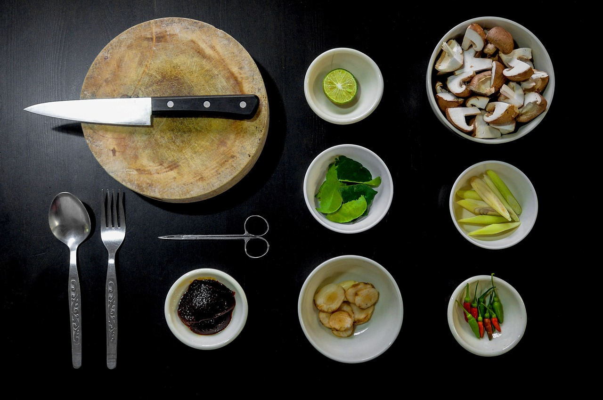

class: middle, left
count: false

# What's holding us back  on our way towards  _Open Science_ ?

Willi Rath | <wrath@geomar.de>

&nbsp;

.smaller[Based on discussions with: _ Martin&nbsp;Claus, Claus&nbsp;Böning,
Torge&nbsp;Martin, Markus&nbsp;Scheinert, Klaus&nbsp;Getzlaff,
Christina&nbsp;Roth, Rafael&nbsp;Abel, Arne&nbsp;Biastoch,
Kristin&nbsp;Burmeister, Julia&nbsp;Getzlaff, Inga&nbsp;Koszalka,
Carsten&nbsp;Schirnick, Claas&nbsp;Faber, Kai&nbsp;Grunau, Stefan&nbsp;Jöhnke,
Lutz&nbsp;Griesbach, Thomas&nbsp;Grunert, Knut&nbsp;Günther,
Friedrich&nbsp;Althausen, GEOMAR Data-Management&nbsp;Team, GEOMAR
IT&nbsp;Department, … _]

&nbsp;

.smaller[.right[
online slides —
<https://willirath.github.io/> → Talks 
Git repo:
<https://github.com/willirath/2019-02-01_what_is_holding_us_back_on_our_way_towards_open_science/>]]

---

class: middle, center

# This is _not_ a talk.

---

class: middle, left

# Open Science

- _…_

- _Open Educational Resources_

- _Open Access_

- _Open Peer Review_

- _Open Methodology_

- _Open Source_

- _Open Data_

- _…_

&nbsp;

&nbsp;

.right[.smaller[<https://en.wikipedia.org/wiki/Open_science>]]

---

class: middle, left
count: false

# Open Science

- _…_

- _(Open Educational Resources)_

- _(Open Access)_

- _(Open Peer Review)_ &nbsp;&nbsp; ← &nbsp; Might touch the same issues.

- _Open Methodology_ &nbsp;&nbsp; ← &nbsp; I'll talk about this.

- _Open Source_ &nbsp;&nbsp; ← &nbsp; I'll talk about this.

- _Open Data_ &nbsp;&nbsp; ← &nbsp; I'll talk about this.

- _…_

&nbsp;

&nbsp;

.right[.smaller[<https://en.wikipedia.org/wiki/Open_science>]]

---

class: middle, center

.smaller[.right[ [This notebook][fig_00_notebook_on_nbviewer] has details.]]

???

_**External**_ motivation: growing public debate about the
“reproducibility crisis”

---

class: middle, center

.smaller[.right[From [Baker (2016)][Baker2016]]]

???

Study surveyed researchers from all branches of the sciences see a crisis.

---

class: middle

## ... not my department?

_Public debate_ mostly focused on _fraud prevention_ in the medical
sciences.

.right[— I’ll argue that it’s _**you**_ who’d benefit from reproducibility.]

???

_**your**_ benefits > requirements by journals / funding agencies

---

class: middle, center

.center[]

---

class: middle, left

.smaller[.right[From [Easterbrook (2014)][Easterbrook2014]]]

???

Avoid _philosophic_ or _semantic_ subtleties by reducing objective to simplest
of the possible tasks:  Being able to _**repeat**_ whatever was done.

---

class: middle, left

## Repeatability _~~Reproducibility~~_

> Let’s say an analysis is _repeatable_, if for any _sufficiently skilled_
> reader it is _in principle_ possible to _completely understand_ and
> _repeat all steps_ the authors took from their initial idea to the final
> conclusions.

???

Or worded differently:  Make sure there’s no need to know any _**secrets**_ to
repeat what was done.

---

class: top, left

## Example — A Simple Time Series?

.center[]

> .center[_**Figure 01.**_ Annual-mean HadISST anomalies.]

---

class: left, top
count: false

.center[]

[This notebook][fig_03_notebook_on_nbviewer] shows _**12** variants_ of this
simple plot.

--

And we didn't even account for the different lengths of calendar months.

---

class: middle, center
count: false

.center[]

.right[.smaller[© [Fabien Perissinotto](https://commons.wikimedia.org/wiki/User:Fabienp)]]

---

class: middle, left

## Building Repeatable Work Flows

1. Provide a data set containing _**all the numbers**_ necessary to re-plot and
   compare the data presented in the analysis.

2. Provide fully _**documented steps**_ from the original data to the final
   presentation.

3. Provide an overview of all the _**tools**_ and _**libraries**_ used in the
   analysis and of their exact versions.

4. Provide a pointer to the full _**raw data**_ used in the analysis.

5. Provide a full _**time line**_ of the development of the analysis.
   _← That’s more of a bonus._

???

## Reminder:

Repeatability = sufficiently skilled reader is able to understand and repeat

---

class: middle, left
count: false

## Building Repeatable Work Flows

1. _all the numbers_

2. _documented steps_

3. _tools & libraries_

4. _raw data_

5. _time line_

---

class: middle, left
count: false

## Building Repeatable Work Flows

1. _all the numbers_ ← already required by many journals

2. _documented steps_ ← already required by many journals

3. _tools & libraries_

4. _raw data_

5. _time line_

---

class: middle, left
count: false

## Building Repeatable Work Flows

1. _all the numbers_ ← already required by many journals

2. _documented steps_ ← already required by many journals

3. _tools & libraries_

4. _raw data_ ← already required by _some_ journals

5. _time line_

---

class: middle, left
count: false

## Building Repeatable Work Flows

1. _all the numbers_ ← already required by many journals

2. _documented steps_ ← already required by many journals

3. _tools & libraries_ ← be prepared for those!

4. _raw data_ ← already required by _some_ journals

5. _time line_ ← be prepared for those!

---

class: center, middle

.center[]

.right[.smaller[[CC0-licenced](https://pixabay.com/en/checkout-retro-antique-590358/)]]

???

# _“all the numbers”_

---

class: center, middle

.center[]

???

# _“documented steps”_

---

class: center, middle

.center[]

.right[.smaller[[CC0-licenced](https://www.pexels.com/photo/black-metal-tools-hanged-on-a-rack-near-table-162631/)]]

???

# _“tools & libraries”_

---

class: center, middle

.center[]

.right[.smaller[[CC0-licenced](https://pixabay.com/en/cooking-ingredient-cuisine-kitchen-1013455/)]]

???

# _“raw data”_

---

class: center, middle

.center[]

.right[.smaller[[CC0-licenced](https://pixabay.com/en/wintry-mountain-snow-snow-landscape-2068298/)]]

???

# _“time line”_

---

class: middle, center

???

## Set Triggers for a Discussion !

---

class: middle, center

.right[.smaller[[CC0-licenced](https://pixabay.com/en/building-blocks-stones-colorful-1563961/)]]

<!-- ---

class: middle, center

.right[.smaller[[CC-by-licenced](https://commons.wikimedia.org/wiki/File:%D0%9C%D0%BE%D1%81%D1%82_%D0%94%D1%91%D0%BC%D0%B0_%D0%91%D0%BE%D1%87%D0%BA%D0%B0%D1%80%D0%B5%D0%B2%D0%BA%D0%B0.jpg)]] -->

---

class: middle, center

---

class: middle, center

&nbsp;

.smaller[.right[
<https://www.americanscientist.org/article/open-science-isnt-always-open-to-all-scientists>
]]

.smaller[.right[
<https://eos.org/opinions/its-time-to-shift-emphasis-away-from-code-sharing>
]]

---

class: smaller, middle

### Reading List

- _“1,500 scientists lift the lid on reproducibility”_: [https://www.nature.com/news/1-500-scientists-lift-the-lid-on-reproducibility-1.19970][Baker2016]
- _“Publish your computer code: it is good enough”_ : [https://www.nature.com/news/2010/101013/full/467753a.html][Barnes2010]
- _“Open code for open science?”_ : [http://www.nature.com/ngeo/journal/v7/n11/full/ngeo2283.html][Easterbrook2014]
- _“Why bitwise reproducibility matters”_ : [https://khinsen.wordpress.com/2015/01/07/why-bitwise-reproducibility-matters/][Hinsen2015]
- _“Which mistakes do we actually make in scientific code?”_ : 
  [http://blog.khinsen.net/posts/2017/05/04/which-mistakes-do-we-actually-make-in-scientific-code/][Hinsen2017]
- _“A Minimum Standard for Publishing Computational Results in the
  Weather and Climate Sciences”_ : 
  [http://journals.ametsoc.org/doi/full/10.1175/BAMS-D-15-00010.1][Irving2015]
- _“Good Scientific Practice at MPI-M”_ : [http://www.mpimet.mpg.de/en/science/publications/good-scientific-practice.html][MPI_good_scientific_practice]
- _“Nature - Code share”_ : [https://www.nature.com/news/code-share-1.16232][Nature_CodeShare]
- _“Ten Simple Rules for Reproducible Computational Research”_ : [http://journals.plos.org/ploscompbiol/article?id=10.1371/journal.pcbi.1003285][Sandve2013]
- _“Best Practices for Scientific Computing”_ : [https://arxiv.org/abs/1210.0530][Wilson2012]
- _“Most computational hydrology is not reproducible, so is it really science?”_: [http://onlinelibrary.wiley.com/doi/10.1002/2016WR019285/full][Hutton2016]
    - first comment: [http://onlinelibrary.wiley.com/doi/10.1002/2016WR020190/full][Anel2016]
    - first reply: [http://onlinelibrary.wiley.com/doi/10.1002/2017WR020480/full][Hutton2017a]
    - second comment: [http://onlinelibrary.wiley.com/doi/10.1002/2016WR020208/full][Melsen2017]
    - second reply: [http://onlinelibrary.wiley.com/doi/10.1002/2017WR020476/full][Hutton2017b]

[anaconda]: https://www.anaconda.com/distribution/

[conda_forge]: https://conda-forge.org/

[data_geomar_de]: https://data.geomar.de

[fig_00_notebook_on_nbviewer]: https://nbviewer.jupyter.org/url/willirath.github.io/2019-02-01_what_is_holding_us_back_on_our_way_towards_open_science/notebooks/fig_00_google_trends.ipynb

[fig_00_data_file_one_pages]: https://willirath.github.io/2019-02-01_what_is_holding_us_back_on_our_way_towards_open_science/data/fig_00_google_trends.csv

[fig_01_notebook_on_nbviewer]: https://nbviewer.jupyter.org/url/willirath.github.io/2019-02-01_what_is_holding_us_back_on_our_way_towards_open_science/notebooks/fig_01_HadISST_global_and_annual_mean_SST_anomalies.ipynb

[fig_01_data_file_on_pages]: https://willirath.github.io/2019-02-01_what_is_holding_us_back_on_our_way_towards_open_science/data/fig_01_HadISST_global_and_annual_mean_SST_anomalies.nc

[fig_02_notebook_on_nbviewer]: https://nbviewer.jupyter.org/url/willirath.github.io/2019-02-01_what_is_holding_us_back_on_our_way_towards_open_science/notebooks/fig_02_HadISST_global_and_annual_mean_SST_anomalies_two_variants.ipynb

[fig_03_notebook_on_nbviewer]: https://nbviewer.jupyter.org/url/willirath.github.io/2019-02-01_what_is_holding_us_back_on_our_way_towards_open_science/notebooks/fig_03_HadISST_global_and_annual_mean_SST_anomalies_all_variants.ipynb

[git_data_on_thredds]: https://data.geomar.de/thredds/catalog/tmdata/git_geomar_de_data/catalog.html

[git_geomar_de]: https://git.geomar.de

[git_geomar_de_data]: https://git.geomar.de/data/

[git_geomar_de_data_docs]: https://git.geomar.de/data/docs/

[git_geomar_de_python_conda_environments]: https://git.geomar.de/python/conda_environments/

[HadISST_on_git]: https://git.geomar.de/data/HadISST/

[jupyter_github]: https://github.com/jupyter/jupyter

[nb_geomar_de]: https://nb.geomar.de

[nb_user_guide]: https://git.geomar.de/python/doc/blob/master/nb_user_guide.md

[semver_for_data_on_git]: https://git.geomar.de/data/docs/blob/master/versioning.md

[talk_git_repo]: https://gitlab.com/willirath/towards_reproducible_science

[Baker2016]: https://www.nature.com/news/1-500-scientists-lift-the-lid-on-reproducibility-1.19970

[Barnes2010]: https://www.nature.com/news/2010/101013/full/467753a.html

[Bhadrwaj2014]: https://arxiv.org/abs/1409.0798

[Chavan2015]: https://arxiv.org/abs/1506.04815

[Easterbrook2014]: http://www.nature.com/ngeo/journal/v7/n11/full/ngeo2283.html

[Hinsen2015]: https://khinsen.wordpress.com/2015/01/07/why-bitwise-reproducibility-matters/

[Hinsen2017]: http://blog.khinsen.net/posts/2017/05/04/which-mistakes-do-we-actually-make-in-scientific-code/

[Irving_carpentry]: http://damienirving.github.io/capstone-oceanography/03-data-provenance.html

[Irving2015]: http://journals.ametsoc.org/doi/full/10.1175/BAMS-D-15-00010.1

[Merali2010]: https://www.nature.com/doifinder/10.1038/467775a

[MIAME]: http://fged.org/projects/miame/

[MPI_good_scientific_practice]: http://www.mpimet.mpg.de/en/science/publications/good-scientific-practice.html

[Nature_CodeShare]: https://www.nature.com/news/code-share-1.16232

[Sandve2013]: http://journals.plos.org/ploscompbiol/article?id=10.1371/journal.pcbi.1003285

[Stodden2010]: https://papers.ssrn.com/sol3/papers.cfm?abstract_id=1550193

[Wilson2012]: https://arxiv.org/abs/1210.0530

[XSEDE2014_repro]: https://www.xsede.org/documents/659353/d90df1cb-62b5-47c7-9936-2de11113a40f

[Hutton2016]: http://onlinelibrary.wiley.com/doi/10.1002/2016WR019285/full

[Anel2016]: http://onlinelibrary.wiley.com/doi/10.1002/2016WR020190/full

[Hutton2017a]: http://onlinelibrary.wiley.com/doi/10.1002/2017WR020480/full

[Melsen2017]: http://onlinelibrary.wiley.com/doi/10.1002/2016WR020208/full

[Hutton2017b]: http://onlinelibrary.wiley.com/doi/10.1002/2017WR020476/full

[vollkorn]: http://vollkorn-typeface.com/
